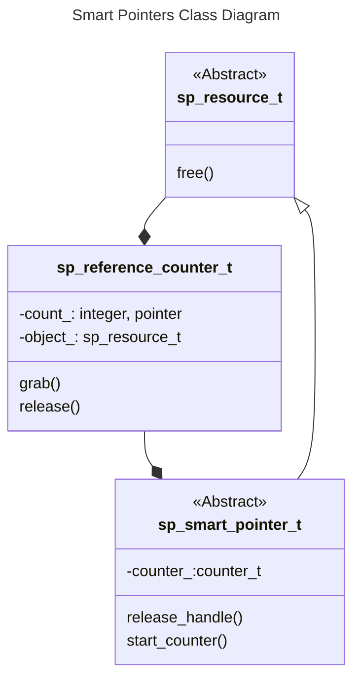

Classes
-------

The Unified Modeling Language (UML) class diagram below depicts the classes
in the Smart-Pointer library.  Non-abstract user-defined derived types that
extend `sp_smart_pointer_t` inherit an obligation to define the `free` deferred
binding according to the `free_interface` abstract interface defined in 
`sp_resource_m`.  The user-defined `free` subroutine must free the associated
resource, which usually means deallocating the associated memory.

